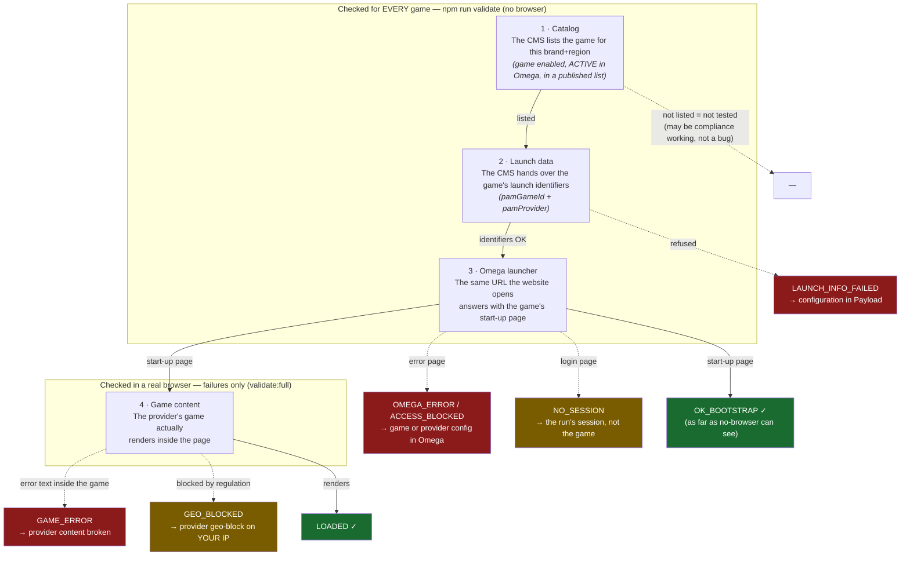

# Casino V2 — Game Catalog Validator

**What this tool does:** it checks, automatically, that every game a brand offers in
Casino V2 can actually be launched — the same thing you do by hand when you open a
game page, press Play and wait to see if the game loads or shows an error. Instead of
clicking through thousands of games, the tool does it for you and gives you a
spreadsheet of which games failed and why.

- Ticket: [TECH-3635](https://app.clickup.com/t/86cb6qzv1)
- How it works internally (for developers): [`docs/technical-proposal.md`](docs/technical-proposal.md)

## What exactly is being tested

When a player opens a game, three things have to work in a row:

1. **The CMS knows the game** — the game appears in the brand's catalog and its
   launch data is complete.
2. **Omega accepts the launch** — the same launcher URL the website builds when you
   press Play responds with the game, not with an error page.
3. **The game really shows on screen** — the game content loads inside the page
   without an error message.

The tool checks **1 and 2 for every game** without opening a browser (fast — about
30 minutes for a 3,500-game catalog), and check **3 with a real browser** for the
games that look broken, taking a screenshot of each as proof.

Nothing ever plays the games: no bets, no clicks inside the game. It only verifies
that they open.

## The journey of opening a game — and where each error lives

When a player presses Play, the request travels through four stations. Each one can
fail in its own way, and every result category in the report points at exactly one
station — so the CSV doesn't just say "broken", it says **where**:



How to read it:

- **Stations 1–3** are pure web requests — that's why `npm run validate` can cover
  the whole catalog in minutes. Station 4 needs real eyes (a browser), so only the
  failures get it, automatically, in `npm run validate:full`.
- **Red boxes** are games broken for players; the arrow tells you which team/system
  to point the ticket at. **Yellow boxes** are not the game's fault: `NO_SESSION`
  is the run's login, `GEO_BLOCKED` depends on the country your machine connects
  from.
- A game that never enters at station 1 simply isn't in the report: the catalog
  only serves games that are enabled, ACTIVE in Omega and in a published list —
  absence can be the country filter doing its compliance job, not a failure.

## What you need before starting

- **Node.js 20 or newer** installed (ask IT, or download from nodejs.org).
- A **QA test account** for the brand you want to test — the usual ones from the
  "QA Testing accounts" page in ClickUp. The tool logs in by itself with it.
- Five minutes to fill in a small configuration file (next section).

## Step-by-step

### 1. Get the tool

```bash
git clone git@github.com:raquel-wkg/TECH-3635-casinov2-games-tests.git
cd TECH-3635-casinov2-games-tests
```

### 2. Install the browser runner (one time — only for the browser steps)

```bash
npm install && npx playwright install chromium
```

**When do you need this?** Only for the commands that open a real browser: the
full test (step 5) and the by-hand check (step 7). The first check (step 4) uses
nothing but Node — if that's all you want today, skip this step; you can come
back to it whenever you want screenshots.

### 3. Create your configuration file

Copy the example and open it in any text editor:

```bash
cp .env.example .env
```

The `.env` file is a list of `NAME=value` lines. You only need to fill in four:

| Setting | What it is | Example (Betjordan staging) |
|---|---|---|
| `SITE_URL` | The website of the brand you're testing | `https://betjordan.stage24.net` |
| `OMEGA_BRAND_ID` | The brand's id as known in Omega/portal | `5` |
| `PORTAL_REGION_ID` | The region's id in the portal (empty = the brand's any-region catalog) | `11` |
| `TEST_USER` / `TEST_PASSWORD` | Your QA test account for that brand | from the ClickUp page |

The tool resolves every internal id by itself. If an id is wrong, it answers
with the list of existing brands or regions and their names, so you can just copy
the right one. Leaving `PORTAL_REGION_ID` empty tests the brand's whole any-region
catalog — the same convention as a null region in Payload.

### 4. First check — no browser needed

```bash
npm run validate
```

This alone already finds the broken games. It will, on its own:

1. Download the **full list of games** the brand offers in Casino V2 (from the CMS).
2. Log in with your test account.
3. For **every game**, ask the CMS for its launch data and then request the same
   Omega launcher URL the website would open — and read the answer: game or error?
4. Write the results to a file.

It needs nothing but Node — step 2 is not required for this. You'll see progress
on screen (`25/125`, `50/125`…) and at the end a summary like:

```
Summary by category: { OK_BOOTSTRAP: 119, OMEGA_ERROR: 6 }
Report: results/run-2026-08-18…json / results/run-2026-08-18….csv
```

That `.csv` file opens in Excel/Google Sheets. **That's your deliverable**: one row
per game with its name, provider and result.

### 5. Full test — adds browser proof for the failures

```bash
npm run validate:full
```

Same as above, plus: it re-opens **the games that failed** in a real automated
browser, exactly like a player would, adds the browser's verdict to the report, and
saves a **screenshot of each one** — ready to attach to tickets. Requires the
browser runner from step 2.

### 6. Reading the results

The `category` column tells you which part failed, in plain terms:

| Category | Meaning | What to do |
|---|---|---|
| `OK_BOOTSTRAP` | Omega's launcher served the game's start-up page instead of an error. This is as far as a check without a browser can see — see the note below the table. | Nothing. |
| `OMEGA_ERROR` | Omega answered with its error page ("An unexpected error has occurred… error id N"). The game is broken for players. | Report it — the `detail` column has Omega's error id for the ticket. |
| `LAUNCH_INFO_FAILED` | The CMS refused to hand over the game's launch data — its serving filters block the game (disabled or discarded editorially, INACTIVE in Omega, or country-blacklisted). | Look the game up in Payload: the blocking flag is visible there, though fixing an INACTIVE status happens in Omega, not Payload. Rare in a sweep — catalog and launch data use the same filters, so this usually means the game changed mid-run. |
| `NO_SESSION` | The test account's session didn't work — a problem of the *run*, not of the game. | Check the credentials and rerun. |
| `ACCESS_BLOCKED` / `LAUNCHER_4XX/5XX` | The platform refused or failed. | Report with the row's detail. |
| `SUSPICIOUS_EMPTY` | The answer was too small to judge. | The browser pass resolves it. |

**Why "OK_BOOTSTRAP" and not just "OK"?** Because it says exactly what was proven.
The HTTP status code alone means nothing here — every broken game we've found
answered a perfectly normal HTTP 200, with the error inside the page. So the tool
reads the page content: an error page → one of the failure categories; the game's
real start-up document → `OK_BOOTSTRAP`. That is a very strong signal that the game
launches, but it is not the same as *seeing* the game render on screen — only the
browser step proves that, and its "yes" is called `LOADED`. Keeping the two names
apart keeps the report honest about which of the two checks each verdict comes from.

For failed games, the **`browserCategory`** column adds the real-browser verdict:
`GAME_ERROR` (a player sees the error — screenshot attached), `GEO_BLOCKED`
("blocked by regulation": may just mean the wrong country to test from, see below),
or `LOADED` (it actually works in the browser — the HTTP failure was transient).

**Tip:** failures that share the same provider usually mean the *provider's* product
is misconfigured in that environment — one issue, not one per game.

### 7. (Optional) Check specific games by hand

```bash
npm run validate:browser -- 38510 32540
```

Opens just those game ids (from the CSV) in the automated browser — same verdicts,
same screenshots in `results/screenshots/run-<date>/` (the same date as the CSV/JSON report). Useful to re-verify a fix or to grab a
screenshot for a ticket without re-running the whole sweep.

## If the login fails

The run stops before testing anything if it can't log in. The error tells you which
of the two cases you're in:

| Error starts with | Cause | What to do |
|---|---|---|
| `Login rejected …` ("The username or password was incorrect") | Wrong `TEST_USER` / `TEST_PASSWORD`. | Check them against the ClickUp "QA Testing accounts" page — **for the environment you're testing**: staging and production accounts are different. |
| `Login failed …` (HTTP 502, database/SQL errors) | The environment itself is having trouble — the tool already retried once. | Nothing on your side. Try again in a few minutes; if it keeps happening, report it (the error text is exactly what ops needs). |

Both can look alike when the environment is degraded: a wrong password may surface
as server errors until the environment answers properly. If in doubt, fix the
credentials first, then retry.

## Trying it out on just a few games

Before a full sweep, you can do a quick dry run — same `.env`, one extra variable:

```bash
MAX_GAMES=10 npm run validate:full
```

`MAX_GAMES` limits the check to the first N games of the catalog (empty = all).
Perfect for verifying your configuration and credentials in under a minute.

## All settings

Everything the `.env` accepts. Only the first block is required.

| Variable | Default | What it does |
|---|---|---|
| `SITE_URL` | — | The brand website under test. The CMS/Omega/middleware hosts are derived from it. |
| `OMEGA_BRAND_ID` | — | The brand's id as known in Omega/portal. |
| `PORTAL_REGION_ID` | *(empty)* | The region's id in the portal. Empty = the brand's any-region catalog. |
| `TEST_USER` / `TEST_PASSWORD` | — | QA test account; the tool logs in and re-logs in by itself. |
| `MAX_GAMES` | *(all)* | Check only the first N games — quick dry runs. |
| `MAX_BROWSER_GAMES` | `25` | Cap on how many suspects the automatic browser pass opens. |
| `CONCURRENCY` | `5` | Games checked in parallel (~2 games/second). Don't raise above 10 without checking with the team. |
| `REQUEST_TIMEOUT_MS` | `20000` | How long to wait for each request before marking it failed. |
| `PLAYER_COUNTRY` / `IP_COUNTRY` | *(empty)* | Empty = full catalog (recommended). Set both to see exactly one market's view. |
| `LOCALE` | `en` | Language for game titles in the report. |
| `SESSION_KEY` | *(empty)* | A ready Omega session — alternative to `TEST_USER`/`TEST_PASSWORD`. |
| `CMS_URL` / `PS_URL` / `MW_URL` | *(derived)* | Override the derived hosts if an environment doesn't follow the `yweave.`/`ps.`/`back.` convention. |
| `CMS_BRAND_ID` / `CMS_REGION_ID` | *(resolved)* | Advanced: skip the id resolution with explicit CMS-internal ids. |

## Things worth knowing

- **Run it when nobody is editing the catalog.** The game list is downloaded page by
  page, so if an editor publishes or removes a game list mid-run, the pages can shift
  under the tool's feet. It protects itself (duplicates are dropped and a warning is
  printed), but a game could still slip between pages — prefer running outside
  editorial working hours, and re-run if you see the "catalog changed while paging"
  warning.
- **Country settings**: leave `PLAYER_COUNTRY`/`IP_COUNTRY` empty to test the whole
  catalog (recommended). Fill both to see exactly what a player from one market sees.
- **Geo-blocks in the browser step** depend on the country your machine's internet
  connection appears from — a "blocked by regulation" result may just mean "wrong
  country to test this game from", not a broken game. Use the market's VPN when it
  matters.
- **Keep it gentle**: the default settings check ~2 games per second. Don't raise
  `CONCURRENCY` above 10 without checking with the team — these are real requests to
  Omega.
- **Never commit or share your `.env`** — it contains the test account's password.
  The file is git-ignored on purpose.

## For developers

Architecture, launch-flow documentation, error-marker calibration, scale estimates
and the follow-up plan: [`docs/technical-proposal.md`](docs/technical-proposal.md).
All requests mirror the real client (`launch-info` params, `prepareGameIframeLink`
URL building, localStorage session envelope); if the client changes, mirror it here.
The error classifier is a list in `src/classify.js` (HTTP) and `src/browser.js`
(browser) — extend it whenever QA meets a new error text.
